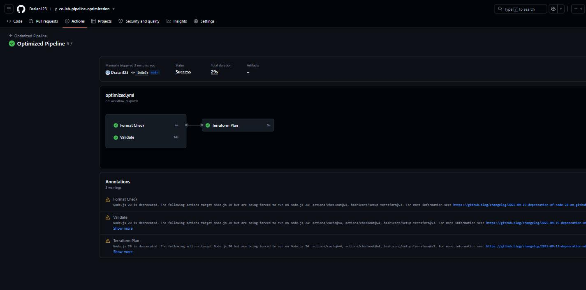
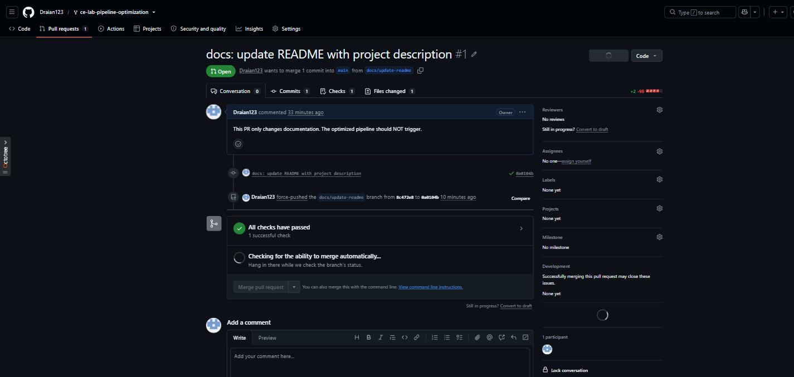
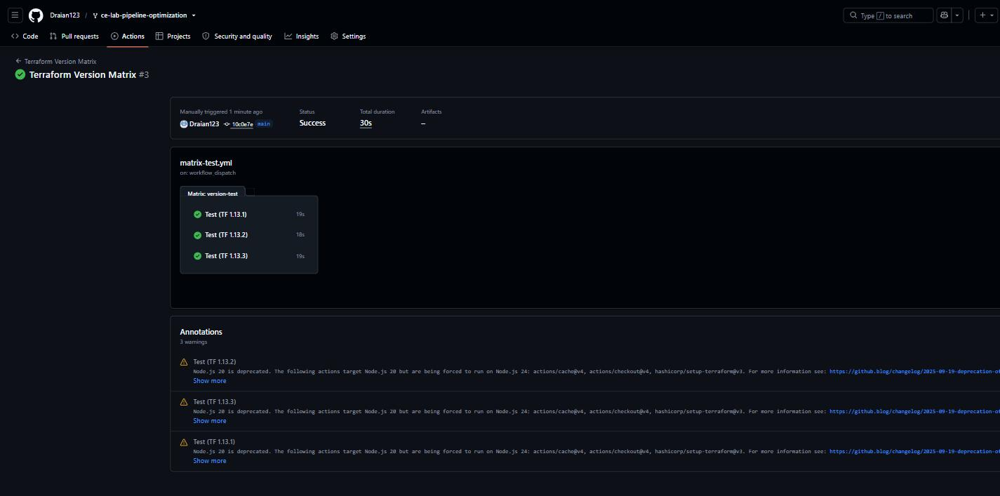
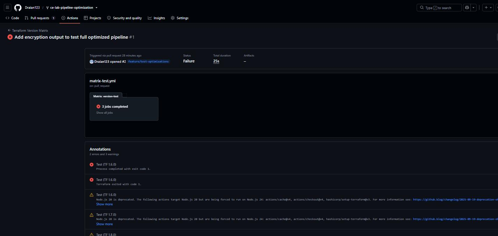

# Lab M5.09 - Pipeline Optimization & Performance

**Cloud Engineering Bootcamp — Week 5, Day 5 · Module: Cloud Automation & CI/CD**

A deliberately slow Terraform CI pipeline, four optimization techniques applied to it, and the
measurements that show what each one actually bought — including the case where it bought nothing.

All numbers below come from real runs in this repository's
[Actions history](https://github.com/Draian123/ce-lab-pipeline-optimization/actions).

---

## Pipeline Performance Comparison

All pipelines run **Terraform 1.13.1**. Every measurement below was taken on that version, with the
provider cache deleted beforehand so the cold numbers are real.

| Metric | Baseline (Slow) | Optimized |
|--------|-----------------|-----------|
| Total wall-clock duration | **14 s** ([run](https://github.com/Draian123/ce-lab-pipeline-optimization/actions/runs/31370828181)) | **29 s** warm cache ([run](https://github.com/Draian123/ce-lab-pipeline-optimization/actions/runs/31370981166)) · 34 s cold ([run](https://github.com/Draian123/ce-lab-pipeline-optimization/actions/runs/31370828252)) |
| Billable job time | 12 s in 1 job | 29 s across 3 jobs (36 s cold) |
| `terraform init` | 5 s, **never cached** | 5 s cold → **1 s cached** |
| Job structure | 1 sequential job | 3 jobs: `lint` ∥ `validate` → `plan` |
| Path filtering | none — runs on every change | `terraform/**` + own workflow file only |
| Version testing | single version (1.13.1) | matrix: 1.13.1, 1.13.2, 1.13.3 in parallel |
| Docs-only commit | full pipeline runs | **skipped entirely** |

> **Read the wall-clock row carefully.** On this workload the optimized pipeline is *slower*, and
> that is the honest result — see [Where the optimizations actually pay off](#where-the-optimizations-actually-pay-off).
>
> Caching still does its job: warm cache beats cold by 5 s, and `init` drops from 5 s to 1 s.

---

## Optimizations Applied

### 1. Dependency caching — `actions/cache@v4`

`.terraform/` and `.terraform.lock.hcl` are cached, keyed on a hash of the lock file with a
`terraform-providers-` restore-key prefix, so a cache from a previous run is reused whenever the
provider set is unchanged.

| `terraform init` | Duration | Evidence |
|------------------|----------|----------|
| Baseline (no cache, every run) | 5 s | [run 31370828181](https://github.com/Draian123/ce-lab-pipeline-optimization/actions/runs/31370828181) |
| Optimized, cache miss | 5 s (+5 s to save the cache) | [run 31370828252](https://github.com/Draian123/ce-lab-pipeline-optimization/actions/runs/31370828252) |
| Optimized, cache hit | **1 s** (+2–4 s to restore) | [run 31370981166](https://github.com/Draian123/ce-lab-pipeline-optimization/actions/runs/31370981166) |

**80 % faster `init` on a cache hit** (5 s → 1 s). Note that restore/save themselves cost 2–5 s for a
110 MB entry, so with only two providers the net saving is close to zero; the technique scales with
provider count and size, not with the number of jobs using it.

Caches are branch-scoped on GitHub: a cache saved on a feature branch is *not* visible to `main`.
That is why the first `main` run after the merge still missed and had to repopulate it.

### 2. Job parallelization

`lint` and `validate` have no `needs:` between them, so they start together; `plan` declares
`needs: [lint, validate]`.

```
baseline:   init ── fmt ── validate ── plan          (one runner, strictly sequential)

optimized:  lint      ┐
            validate  ┘── plan                       (three runners)
```

Measured on [run 31370828252](https://github.com/Draian123/ce-lab-pipeline-optimization/actions/runs/31370828252):
`Format Check` and `Validate` both started at `08:36:41–42Z` — genuinely concurrent — and `plan`
started at `08:37:02Z`, after both finished.

Total ≈ `max(lint, validate) + plan` instead of `lint + validate + plan`.



### 3. Path filters + a conditional step

```yaml
on:
  pull_request:
    paths:
      - 'terraform/**'
      - '.github/workflows/optimized.yml'
```

Verified with two pull requests against the same repository:

| PR | Changes | Baseline pipeline | Optimized pipeline | Version matrix |
|----|---------|-------------------|--------------------|----------------|
| [#1](https://github.com/Draian123/ce-lab-pipeline-optimization/pull/1) | `README.md` only | ✅ ran (16 s wasted) | ⛔ **not triggered** | ⛔ **not triggered** |
| [#2](https://github.com/Draian123/ce-lab-pipeline-optimization/pull/2) | `terraform/outputs.tf` | ✅ ran | ✅ ran | ✅ ran |

The filter holds on `main` too: the commit that added this README and the screenshots below
triggered **zero** workflow runs, while the previous commit — which touched `optimized.yml` — ran the
full pipeline.

PR #1 is the anti-pattern made visible: the unfiltered baseline burned a runner to check Terraform
files that nobody touched. One check on a documentation-only PR, where the baseline alone would have
run three:



The same idea is applied at step level — `plan` is skipped when no AWS credentials are configured,
instead of failing the pipeline:

```yaml
- name: Terraform Plan
  id: plan
  if: env.AWS_ACCESS_KEY_ID != ''
```

### 4. Matrix testing

`strategy.matrix` runs `init` + `validate` + `fmt` against three Terraform versions with
`fail-fast: false` and per-version cache keys.

[Run 31371022376](https://github.com/Draian123/ce-lab-pipeline-optimization/actions/runs/31371022376):
1.13.1, 1.13.2 and 1.13.3 finished in **30 s wall-clock** (jobs of 19 s, 18 s and 19 s, all with cold
per-version caches). Run sequentially the same work would take ~56 s.



**The matrix immediately earned its keep.** The first version matrix
([run 31366509571](https://github.com/Draian123/ce-lab-pipeline-optimization/actions/runs/31366509571))
tested 1.6.0, 1.7.0 and 1.8.0 — and 1.6.0 failed while the other two passed:



```
│ Error: Failed to install provider
│ Error while installing hashicorp/aws v5.100.0: error checking signature:
│ openpgp: key expired
```

HashiCorp's release signing key (`72D7468F`) expired on 2026-04-18. Terraform 1.6.0 ships an
embedded copy of that key and can no longer verify provider signatures; 1.7.0+ can. Without
`fail-fast: false` the run would have aborted and hidden the fact that only one version was broken.
Both pipelines now pin **1.13.1**, and the matrix covers the 1.13.x patch line (1.13.1 / 1.13.2 /
1.13.3) — close enough together to catch a regression between patch releases, far enough from the
expired-key era to be usable.

---

## Where the optimizations actually pay off

The optimized pipeline takes **more** wall-clock time than the baseline here (29 s vs 14 s), and
costs **3 billable job-minutes instead of 1** — GitHub bills every job rounded up to the minute.

The reason is workload size. Each extra job pays a fixed toll:

| Fixed per-job cost | Measured |
|--------------------|----------|
| Runner provisioning (`Set up job`) | 1 s |
| Checkout + `setup-terraform` | 2 s |
| Cache restore/save (110 MB) | 2–5 s |
| Queue wait before a dependent job starts | 2 s |

That is 5–10 s of overhead per job, paid three times instead of once. The useful work in this
repository — four small resources, no real `plan` — is 1–5 s per step, so the overhead dominates and
parallelism has nothing to hide.

Parallelization wins once each stage is longer than the per-job overhead. With a realistic
`plan` against AWS (~90 s) and a larger provider set:

| | Baseline (sequential) | Optimized (parallel + cache) |
|---|---|---|
| init | 30 s | 3 s (cached) |
| fmt + validate | 5 s + 20 s | max(5 s, 23 s) = 23 s |
| plan | 90 s | 93 s |
| **Total** | **~145 s** | **~120 s**, and 0 s on docs-only commits |

**Conclusion:** caching and path filtering pay off at any size; job splitting only pays off once a
stage is long enough to outweigh 5–10 s of runner overhead. On a pipeline this small, the correct
optimization is the path filter — it removes 100 % of the cost on documentation commits.

---

## Cost Optimization Analysis

| Scenario (per merged change) | Baseline | Optimized |
|------------------------------|----------|-----------|
| Terraform change | 1 job-minute | 3 job-minutes |
| Docs-only change | 1 job-minute | **0** |
| PR with 3 pushes, docs-only | 3 job-minutes | **0** |

For a team where roughly half of commits touch no Terraform, the path filter alone removes ~50 % of
pipeline invocations. Additional levers used or recommended:

- **Disable dead workflows.** `baseline-slow.yml` was renamed to `.disabled` once the comparison was
  recorded, so it stops consuming minutes.
- **`concurrency` groups** to cancel superseded runs on rapid pushes (not enabled here).
- **Watch cache storage, not just minutes.** Each provider cache entry is **110 MB**, and the matrix
  creates one *per Terraform version*. Three matrix versions plus the shared key is ~440 MB against
  the 10 GB per-repository limit — GitHub evicts least-recently-used entries once that fills, which
  silently turns cache hits back into misses.
- **Merge tiny jobs.** On a pipeline this small, `lint` and `validate` in one job would be both
  faster and cheaper than two.

---

## Repository Structure

```
ce-lab-pipeline-optimization/
├── .github/workflows/
│   ├── baseline-slow.yml.disabled   # anti-pattern reference: sequential, no cache, no filters
│   ├── optimized.yml                # caching + parallel jobs + path filter + conditional plan
│   └── matrix-test.yml              # Terraform 1.13.1 / 1.13.2 / 1.13.3 in parallel
├── terraform/
│   ├── main.tf                      # S3 logs bucket: versioning, SSE, public access block
│   ├── variables.tf
│   └── outputs.tf
├── docs/screenshots/                # evidence from the Actions runs
├── .gitignore
└── README.md
```

## Anti-patterns in the baseline

| Anti-pattern | Cost | Fix |
|--------------|------|-----|
| No provider caching | 5 s of downloads every run | `actions/cache@v4` |
| One sequential job | independent checks wait on each other | split jobs, `needs:` only where real |
| No path filter | runs on README changes | `paths:` filter |
| Single Terraform version | version breakage found in production | `strategy.matrix` |
| Hard failure without credentials | red pipeline on every fork | `if: env.AWS_ACCESS_KEY_ID != ''` |

## Key Takeaways

1. **Measure first.** The technique that "obviously" helps (parallel jobs) made this pipeline slower
   and 3× more expensive. Only the measurement showed it.
2. **Caching is nearly free to add** and scales with dependency size — but restore/save is not free,
   so tiny dependency sets barely benefit.
3. **Path filters are the highest-leverage optimization** for repositories that mix code and docs:
   the fastest pipeline is the one that does not run.
4. **`fail-fast: false` is what makes a matrix useful** — it turned a total failure into the precise
   answer "1.6.0 is broken, 1.7.0 and 1.8.0 are fine".
5. **Per-job overhead is real** (5–10 s on GitHub-hosted runners). Do not split work smaller than it.

## Notes / known limitations

- `terraform plan` is skipped: no `AWS_ACCESS_KEY_ID` / `AWS_SECRET_ACCESS_KEY` secrets are
  configured in this repository. Adding them makes the step run and post its output as a PR comment
  (`actions/github-script@v7`, already wired up).
- `.terraform.lock.hcl` is not committed, so the cache key hash is empty and the key never busts on
  its own. Committing a cross-platform lock file
  (`terraform providers lock -platform=linux_amd64 -platform=windows_amd64`) would make the cache key
  version-aware — the recommended next step.

## Resources

- [GitHub Actions caching](https://docs.github.com/en/actions/using-workflows/caching-dependencies-to-speed-up-workflows)
- [Docker build cache](https://docs.docker.com/build/cache/)
- [GitHub Actions best practices](https://docs.github.com/en/actions/learn-github-actions/best-practices-for-github-actions)
- [hashicorp/terraform#38418 — provider install fails with `openpgp: key expired`](https://github.com/hashicorp/terraform/issues/38418)
